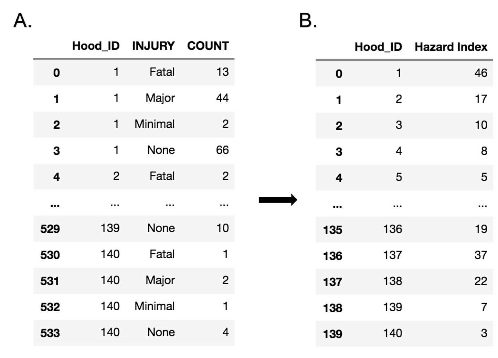
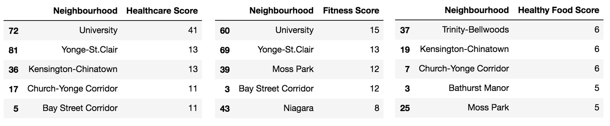
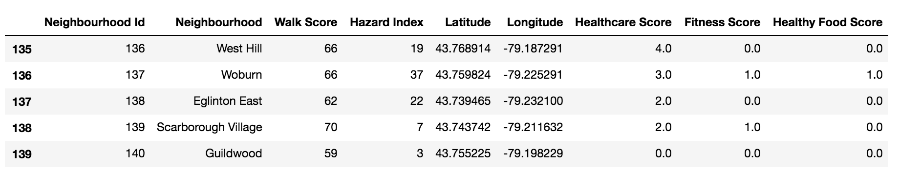

# Introduction

## Background:
The population of people with lower-limb loss has grown over the past decade in Canada [Hussain, et al., 2019]. Across all Canadian provinces, Ontario has the highest percent of amputations with a 37.7% rate [Imam, et al., 2017]. A recent study reports an average of 2787 new lower leg amputations each year from 2006 to 2012 in Ontario alone [Imam, et al., 2017]. This growing population needs accessible housing.

In Canada, similar to most other industrial countries, majority of the lower limb amputation occurs after admission for diabetic complications [Kayssi, et al., 2016, Imam, et al., 2017]. Other factors for leg amputations are trauma, cardiovascular disease, and cancer. Therefore, having a healthy diet and maintaining an active lifestyle is of paramount importance for this population. The neighborhood in which one lives can increase/restrict access to these amenities. 

## Problem:
Therefore, the goal of this project is to compare and rate the neighborhoods in Toronto where lower-limb amputee people will have accessibility to healthcare, exercise, and a healthy diet. 

## Interest:
Finding supportive neighborhoods for people with disabilities has three groups of stakeholders. Similar to most other health-related data science problems, the main stakeholders are the patients. The other important stakeholder is the government. The government can use this information to fund accessible housing with specific features for people with disabilities in select neighborhoods. Finally, providers such as real estate agents can use this information to help clients with special needs find good housing.

# Data

For all the 140 neighborhoods in Toronto, the following information will be collected:
* Information about the **geo coordinates** of each neighborhood using python geopy.geocoders package
* Information about access (i.e. frequency) to 3 categories of venues (**health care**, **fitness** & **healthy food**) in each neighborhood, using Foursquare API
* Walkability scores for each neighborhood from **Wellbeing Toronto - Civics & Equity Indicators Catalog** found in [toronto open data](https://open.toronto.ca/ "").
* Pedestrian saftey index for each neighborhood from **Pedestrians Killed or Seriously Injured (KSI)** found in [toronto police service data](https://data.torontopolice.on.ca/datasets/pedestrians/data "").

Finally, the neighborhoods will be clustered together based on the information about access to health care, fitness, healthy food, Walkability scores, and Pedestrian safety index. 

# Methodology
## Data cleaning
### *Walkability Score*
Toronto has 140 neghibourhoods with specific ID numders. The **Wellbeing Toronto - Civics & Equity Indicators Catalog** was used to find the list of all neghibourhoods in Toronto and their coresponding ID number as well as the walkability score. 

### *Pedestrian Safety Index*
To calculated the pedestrian safety index for each neghibourhood, the Toronto pedestrians related collisions data catalog was used. The data was grouped based on the neghibourhood and severity of the injury (Fig.1A). Weights of 0, -1, -2, -3 and -4 were assigned to injury groups of *None*, *Minimal*, *Minor*, *Major* and *Fatal* respectively. The Hazard Index was then calculated as the weighted average of the injury occurances for each neghibourhood(Fig.1B). Lastly, it was observed that there were no recorded pedestrian accident for the Neigbourhood with id of 114. Therefore a Hazard Index of 0 was assigned to this neighbourhood.

<em>Fig.1 Pedestrian Hazard Index Calculation Process</em>

### *Foursquare Venues*
The biggest chunck of data anlysis in this project is to find the accessibility to specific venues in each nighbourhood. Doing this in Foursquare requires having information about the coordiantes of each neighbourhood. To find the latitude and longitude of each neighbourhood, first each neighbourhood was broken down to the areas it covers. The coordinates of each area was then obtained using geopy.geocoders package. Lastly the latitude and longitude of each neighbourhood was calcualted by taking the average of the coordinates of all coresponding areas. To make sure that the results are in reasonable range, the coordinates were then sorted by both latitude and longitude values. It was observed that the values for 4 neghibourhoods (*Humbermede** (22), *Woodbine Corridor* (64), *Lambton Baby Point* (114), *Wexford/Maryvale* (119)) were missing from the tabel; therefore, those values were imported manually. 

The Foursquare API was then used to *search* the accesibility to **heathcare**, **fitness** and **healthy food** in all neighborhoods of Toronto.
For each industry, specific keywords were used to find the related venues. For the heathcare industry the following keywords were used :*healthcare*, *rehab*, *medical* and *Physical Therapist*. The keywords for the healthy food industry were: *healthy*, *organic*, *natural* and *vegetarian*. Lastey, the keyword *fintness* was used to find the fintess-related venues. For each industry, the venues were grouped by the category to which they were assinged by Foursquare, and irrelevant categories were omitted. Lastly, the industry score for each nieghbourhood was calculated based on the number of avaiable industry_related venues in that area.(see Fig2 as an example) 

<em>Fig.2 Examples of Industry Scores for top neighbourhoods based on avaiable industry_related venues</em>

The data cleaning process was then concluded with combinging all the information into a single dataframe (Fig3).

<em>Fig.2 Examples of Industry Scores for top neighbourhoods based on avaiable industry_related venues</em>

## Machine Learnings (Kmeans)
The goal of this project was to find nieghbourhoods with best accesibility to health-related amenities. Data clutering tecniques are very usefull in recomendation systems when the data is not labled. Therefor, here to find similar nieghbourhoods, the Kmeans method was used. 

# Results

# Discussion
# Conclusion
The neghbourhoods located in the center of Toronto would be the best place for people with lower leg disability in which to reside. 

# Refrences
* Hussain, M. A., Al-Omran, M., Salata, K., Sivaswamy, A., Forbes, T. L., Sattar, N., ... & de Mestral, C. (2019). Population-based secular trends in lower-extremity amputation for diabetes and peripheral artery disease. CMAJ, 191(35), E955-E961.
* Imam, B., Miller, W. C., Finlayson, H. C., Eng, J. J., & Jarus, T. (2017). Incidence of lower limb amputation in Canada. Canadian Journal of Public Health, 108(4), 374-380.
* Kayssi, A., de Mestral, C., Forbes, T. L., & Roche-Nagle, G. (2016). A Canadian population-based description of the indications for lower-extremity amputations and outcomes. Canadian Journal of Surgery, 59(2), 99.
